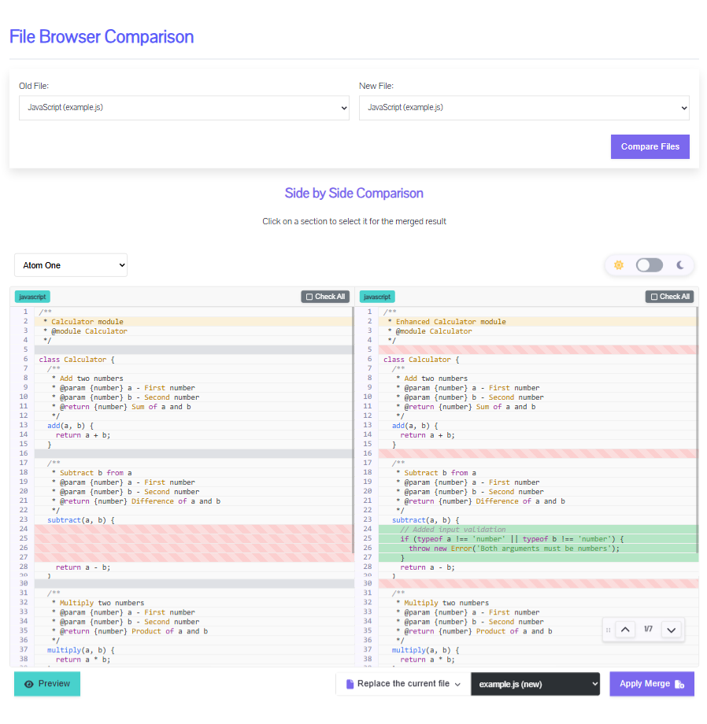
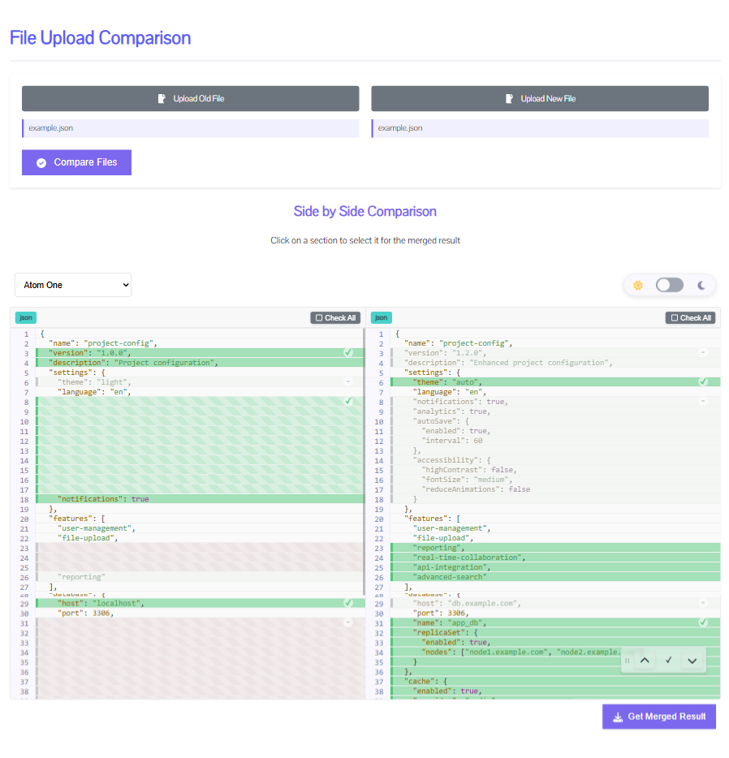
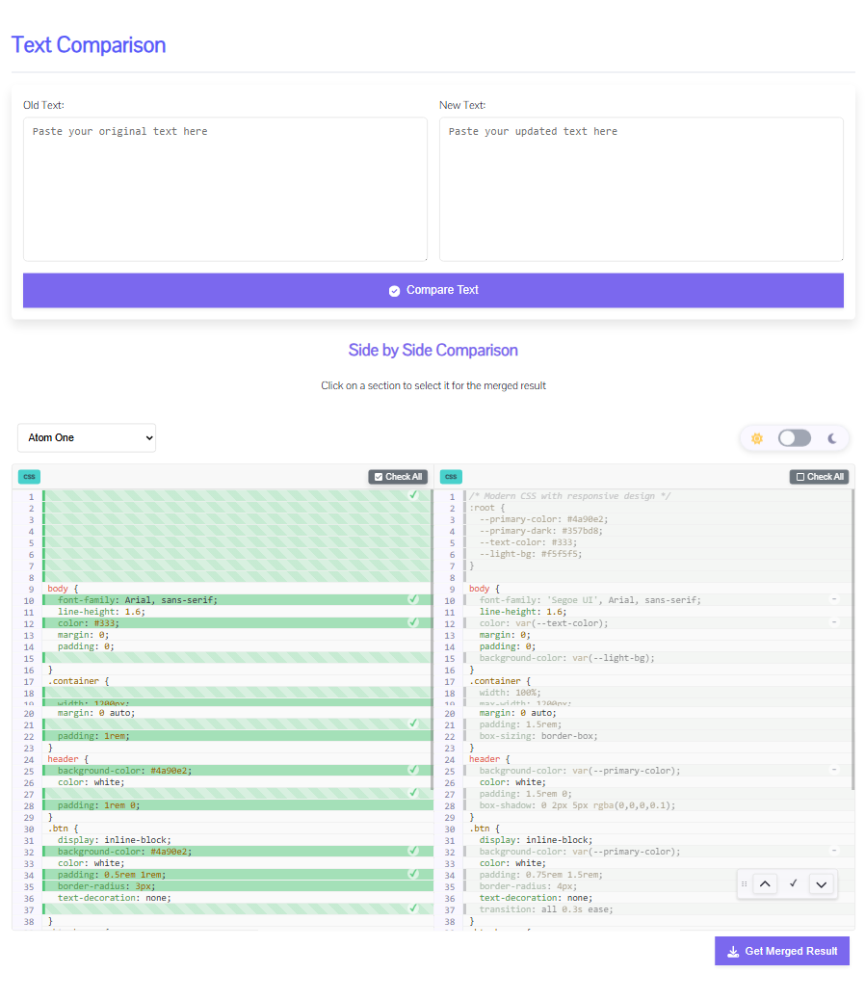
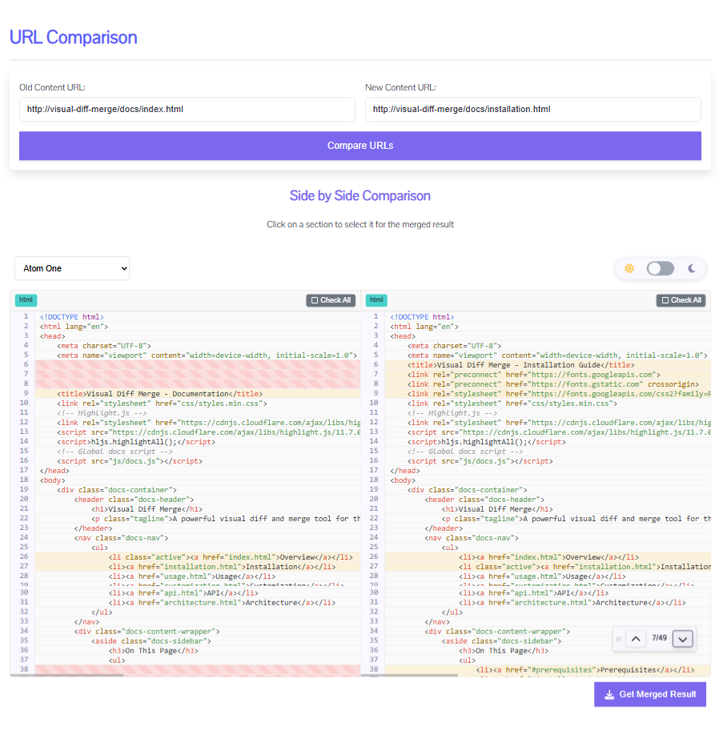

# Visual Diff Merge Tool

[](https://github.com/migliori/visual-diff-merge)
[](https://github.com/migliori/visual-diff-merge/blob/main/LICENSE)
[](https://github.com/migliori/visual-diff-merge/commits/main)
[](https://github.com/migliori/visual-diff-merge/graphs/contributors)
[](https://github.com/migliori/visual-diff-merge/issues)

***Visual Diff-Merge*** is a web-based tool for comparing, selecting, and merging code changes. With a split-view interface, it lets you view two versions side by side for easy diffing and merging. Built with PHP and JavaScript, it supports automatic language detection and syntax highlighting for over 180 programming languages, including HTML, Twig, PHP, JavaScript, JSON, TypeScript, Python, Ruby, Java, C#, CSS, XML, YAML, Markdown, SQL, and many more.



**🔥 [Try it online at visual-diff-merge.miglisoft.com](https://visual-diff-merge.miglisoft.com)** - No installation required!

## 🚀 Features

- **Side-by-side comparison** of files with syntax highlighting
- **Interactive merge** capability to select changes from either version
- **Multiple comparison modes**:
  - **File Browser**: Compare files from a server directory
  - **File Upload**: Upload and compare two local files
  - **Text Compare**: Paste code snippets directly for comparison
  - **URL Compare**: Compare content from two URLs
- **Syntax highlighting** powered by highlight.js with support for over 180 programming languages
- **Responsive design** that works on desktop and tablet devices
- **Customizable themes** with both dark and light modes
- **Language internationalization** support

## 🏁 Quick Start

### Option 1: Use Online Version

Visit **[visual-diff-merge.miglisoft.com](https://visual-diff-merge.miglisoft.com)** to use the tool immediately:
- Upload your files
- Paste code snippets
- Compare content from URLs
- (Note: File Browser mode has limited functionality in the online version)

### Option 2: Self-hosted Installation

Visual Diff Merge is a client-server application that requires both PHP backend and JavaScript frontend:

1. Download or clone the repository
2. Configure your PHP environment (see [Installation](#installation))
3. Copy `api/config.example.php` to `api/config.php` and adjust settings
4. Access one of the example files through a web server:
   - `diff-viewer/file-browser.php` - Browse and compare server files
   - `diff-viewer/file-upload.html` - Upload local files to compare
   - `diff-viewer/text-compare.html` - Compare text/code snippets
   - `diff-viewer/url-compare.html` - Compare content from URLs

## 📸 Screenshots

### File Browser Mode


### File Upload Mode


### Text Compare Mode


### URL Compare Mode


## 🔧 Installation

### Prerequisites

- PHP 7.4 or higher
- Web server (Apache, Nginx, etc.)
- Node.js 14.x or higher (for development only)
- npm 6.x or higher (for development only)

### Server Setup

1. Clone the repository:
   ```bash
   git clone https://github.com/migliori/visual-diff-merge.git
   cd visual-diff-merge
   ```

2. Install PHP dependencies:
   ```bash
   composer install
   ```

3. Configure the project:
   - Copy `api/config.example.php` to `api/config.php`
   - Modify configuration options as needed (see [Configuration](#configuration))

4. Set up your web server to serve the project directory
   - Ensure PHP is properly configured
   - Make sure the `api` directory is accessible

## 📋 Usage Modes

Visual Diff Merge offers four distinct usage modes, each requiring specific files and setup:

### 1. File Browser Mode
- **Required Files**:
  - `file-browser.php`
  - `file-browser.min.js`
- **Description**: Browse files on the server and select two for comparison
- **Example**: `diff-viewer/file-browser.php`

### 2. File Upload Mode
- **Required Files**:
  - `file-upload.html`
  - `file-upload.min.js`
- **Description**: Upload two files from your local machine
- **Example**: `diff-viewer/file-upload.html`

### 3. Text Compare Mode
- **Required Files**:
  - `text-compare.html`
  - `text-compare.min.js`
- **Description**: Enter or paste code snippets to compare
- **Example**: `diff-viewer/text-compare.html`

### 4. URL Compare Mode
- **Required Files**:
  - `url-compare.html`
  - `url-compare.min.js`
- **Description**: Enter URLs to fetch and compare content
- **Example**: `diff-viewer/url-compare.html`

Each mode uses a specific manager component to handle its unique workflow before initializing the core DiffViewer component.

## ⚙️ Configuration

Visual Diff Merge uses a PHP configuration file to control both server and client behavior:

### Main Configuration File
- Location: `api/config.php` (copy from `api/config.example.php`)
- Controls both PHP (server-side) and JavaScript (client-side) settings
- If no custom configuration file is created, the tool will use default settings as detailed in the documentation

### Key Configuration Options

#### PHP Settings
```php
'php' => [
    'debug' => [
        'enabled' => true,  // Enable server-side debugging
        'logLevel' => 3,    // Log verbosity level (1-3)
        'logFile' => 'debug-php-diff.log'  // Log filename
    ],
    'diff' => [
        'contextLines' => 3,  // Number of context lines around changes
        'ignoreWhitespace' => false,  // Ignore whitespace in comparisons
        'ignoreCase' => false  // Ignore case in comparisons
    ],
    // Security settings, path configurations, etc.
]
```

#### JavaScript Settings
```php
'javascript' => [
    'lang' => 'en',  // Default UI language
    'debug' => false,  // Enable client-side debugging
    'logLevel' => 2,   // Client-side log verbosity level
    'theme' => [
        'defaultFamily' => 'atom-one',  // Syntax highlighting theme
        'defaultMode' => 'dark',  // Light or dark mode
        'showSelector' => true  // Show theme selector in UI
    ],
    // UI class customizations, translations, etc.
]
```

For complete configuration options, see the [Configuration Documentation](https://visual-diff-merge.miglisoft.com/docs/installation.html).

## 🏗️ Architecture

Visual Diff Merge follows a client-server architecture:

1. **Backend (PHP)**:
   - Processes diff calculations via the `DiffViewer` PHP class
   - Provides API endpoints for file access and diff processing
   - Manages security and file system access

2. **Frontend (JavaScript)**:
   - Mode-specific manager components handle UI interactions
   - Core `DiffViewer` component displays and manages diffs
   - Theme system provides syntax highlighting and UI theme options

See the [Architecture Documentation](https://visual-diff-merge.miglisoft.com/docs/architecture.html) for more details.

## 👨‍💻 Development

### Building from Source

If you want to modify the source code:

1. Install Node.js dependencies:
   ```bash
   npm install
   ```

2. Development mode with auto-rebuild:
   ```bash
   npm run dev
   ```

3. Build for production:
   ```bash
   npm run build
   ```

### Directory Structure

- `src/` — Source JavaScript files
  - `components/` — Core components including DiffViewer
  - `utils/` — Utility functions
- `php/` — PHP classes for backend processing
- `api/` — PHP API endpoints
- `dist/` — Compiled JavaScript files (generated)
- `diff-viewer/` — Visual Diff Merge implementations
- `docs/` — Documentation

## 🤝 Contributing

Contributions are welcome! Please feel free to submit a Pull Request.

1. Fork the repository
2. Create your feature branch (`git checkout -b feature/amazing-feature`)
3. Commit your changes (`git commit -m 'Add some amazing feature'`)
4. Push to the branch (`git push origin feature/amazing-feature`)
5. Open a Pull Request

## 📱 Browser Compatibility

- **Fully supported**: Chrome, Firefox, Safari, Edge (latest versions)
- **Partial support**: Internet Explorer 11
- **Mobile**: Works best on tablets; limited functionality on smartphones

## 📄 License

This project is licensed under the MIT License - see the [LICENSE](LICENSE) file for details.

## 👏 Acknowledgements

- [highlight.js](https://highlightjs.org/) for syntax highlighting
- [PHP-Diff](https://github.com/chrisboulton/php-diff) for the diff generation

---
📚 **Documentation**: [visual-diff-merge.miglisoft.com/docs/](https://visual-diff-merge.miglisoft.com/docs/)
🌐 **Website**: [visual-diff-merge.miglisoft.com](https://visual-diff-merge.miglisoft.com)
💬 **Issues**: [GitHub Issues](https://github.com/migliori/visual-diff-merge/issues)
